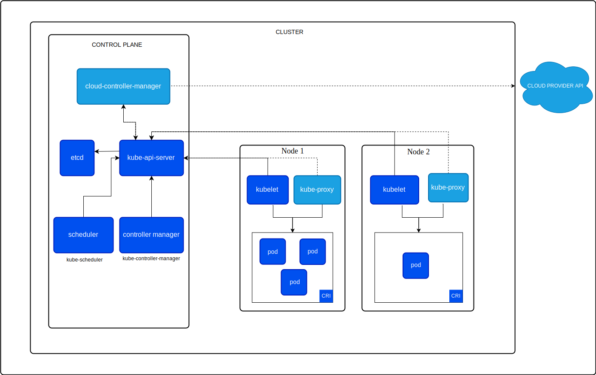

# 🚀 Kubernetes Simplified

A beginner-friendly guide to understanding Kubernetes fundamentals, architecture, and real-world usage.

---

## 📌 What is Kubernetes?

Kubernetes (K8s) is an open-source container orchestration platform used to **automate deployment, scaling, and management of containerized applications**.

👉 In simple terms:

> Docker runs containers.
> Kubernetes manages them at scale.

---

## 🧠 Why Kubernetes?

### ❌ Before Kubernetes

* Manual deployment
* Downtime during updates
* No auto-scaling
* Difficult container management

### ✅ With Kubernetes

* Automated deployment
* Self-healing system
* Auto-scaling based on load
* Zero/low downtime updates

---

## 🏗️ Kubernetes Architecture



### 🔹 1. Control Plane (Brain)

Manages the cluster:

* **API Server**
  Entry point for all commands (`kubectl`)

* **Scheduler**
  Assigns pods to nodes

* **Controller Manager**
  Maintains desired state

* **etcd**
  Stores cluster data (key-value store)

---

### 🔹 2. Worker Nodes (Execution Layer)

Runs applications:

* **Kubelet**
  Communicates with control plane

* **Kube Proxy**
  Handles networking & load balancing

* **Container Runtime**
  Runs containers (Docker, containerd)

---

### 🔹 3. Basic Objects

* **Pod** → Smallest unit (1 or more containers)
* **Deployment** → Manages replicas & updates
* **Service** → Exposes pods
* **ConfigMap / Secret** → Stores configuration

---

## 🔁 Kubernetes Workflow

1. Write a YAML file (Deployment/Service)

```bash
kubectl apply -f app.yaml
```

2. API Server receives request
3. Scheduler assigns node
4. Kubelet creates pod
5. Pod starts running 🚀

---

## ⚙️ Real-World Scenarios

### 🧩 1. Application Crash

**Problem:**
Application container crashes

**Solution:**
Kubernetes automatically restarts the pod (self-healing)

---

### 📈 2. High Traffic (Scaling)

**Problem:**
Traffic spike (e.g., sale/event)

**Solution:**
Use **Horizontal Pod Autoscaler (HPA)**
→ Automatically increases pod replicas

---

### 🔄 3. Zero Downtime Deployment

**Problem:**
Update application without downtime

**Solution:**
Rolling updates via Deployment

```bash
kubectl set image deployment/app app=app:v2
```

---

### 🌐 4. Load Balancing

**Problem:**
Multiple pods handling traffic

**Solution:**
Kubernetes Service distributes traffic evenly

---

### 🔐 5. Sensitive Data Handling

**Problem:**
Hardcoded passwords/API keys

**Solution:**
Use **Secrets**

---

## 📊 Advantages

* High availability
* Auto-scaling
* Self-healing
* Efficient resource usage
* Cloud-agnostic (AWS, Azure, GCP)

---

## ⚠️ Challenges

* Steep learning curve
* Complex debugging
* YAML configuration overhead
* Requires proper monitoring setup

---

## 💬 Final Thought

> Kubernetes is not just a tool, it's a shift from manual operations to automated infrastructure.

---

## ⭐ Contribute

Feel free to fork, improve, and share this project.

---

## 📌 Connect

If you found this helpful, consider giving it a ⭐ and sharing it on LinkedIn.

---

Perfect—this is exactly the kind of hands-on content that makes a **killer GitHub README**. I’ll clean it up, structure it properly, and make it look **professional + recruiter-ready**.

Copy this directly 👇

---

# 🚀 Kubernetes Deployment Guide (App + MySQL)

This repository demonstrates different Kubernetes deployment approaches:

* Multi-container Pod (App + DB together)
* Separate Database Deployment (Best Practice)
* Application Deployment
* Service Exposure & Connectivity

---

## 📦 1. Multi-Container Pod (App + DB in Same Pod)

👉 Used when containers are tightly coupled (sidecar pattern)

⚠️ Not recommended for production

### 📄 `multi-container-pod.yaml`

```yaml
apiVersion: v1
kind: Pod
metadata:
  name: app-db-pod
  labels:
    app: myapp
spec:
  containers:
  
  - name: app-container
    image: nginx
    ports:
      - containerPort: 80

  - name: db-container
    image: mysql:5.7
    env:
      - name: MYSQL_ROOT_PASSWORD
        value: root123
    ports:
      - containerPort: 3306
```

---

### ▶️ Create Pod

```bash
kubectl apply -f multi-container-pod.yaml
```

---

### 🔍 Verify

```bash
kubectl get pods
kubectl describe pod app-db-pod
```

---

### ⚠️ Limitations

* Tight coupling between app and DB
* Cannot scale independently
* If pod crashes → both containers go down

---

## 🗄️ 2. MySQL Deployment (Best Practice)

👉 Database should be deployed separately

### 📄 `mysql-deployment.yaml`

```yaml
apiVersion: apps/v1
kind: Deployment
metadata:
  name: mysql-deployment
spec:
  replicas: 1
  selector:
    matchLabels:
      app: mysql
  template:
    metadata:
      labels:
        app: mysql
    spec:
      containers:
      - name: mysql
        image: mysql:5.7
        env:
        - name: MYSQL_ROOT_PASSWORD
          value: root123
        ports:
        - containerPort: 3306
```

---

### ▶️ Deploy MySQL

```bash
kubectl apply -f mysql-deployment.yaml
```

---

### 🌐 Expose MySQL Service

```bash
kubectl expose deployment mysql-deployment --port=3306 --type=ClusterIP
```

---

## 🚀 3. Application Deployment

👉 Application runs independently and connects to DB via service

### 📄 `app-deployment.yaml`

```yaml
apiVersion: apps/v1
kind: Deployment
metadata:
  name: app-deployment
spec:
  replicas: 2
  selector:
    matchLabels:
      app: myapp
  template:
    metadata:
      labels:
        app: myapp
    spec:
      containers:
      - name: app
        image: nginx
        ports:
        - containerPort: 80
```

---

### ▶️ Deploy Application

```bash
kubectl apply -f app-deployment.yaml
```

---

### 🌐 Expose Application

```bash
kubectl expose deployment app-deployment --type=NodePort --port=80
```

---

## 🔗 Service Communication

👉 Inside Kubernetes cluster, the application connects to MySQL using:

```
mysql-deployment:3306
```

✔️ Reason:

* Kubernetes Service provides internal DNS
* No need to use IP addresses

---

## ⚡ Full Deployment Flow

```bash
# 1. Start cluster
minikube start

# 2. Deploy MySQL
kubectl apply -f mysql-deployment.yaml

# 3. Expose MySQL
kubectl expose deployment mysql-deployment --port=3306 --type=ClusterIP

# 4. Deploy Application
kubectl apply -f app-deployment.yaml

# 5. Expose Application
kubectl expose deployment app-deployment --type=NodePort --port=80

# 6. Verify resources
kubectl get all
```

---

## 🧠 Key Takeaways

* Use multi-container pods only for tightly coupled use cases
* Always deploy databases separately in production
* Use Services for communication between components
* Prefer scalable and loosely coupled architecture

---

## 📌 Future Improvements

* Add Persistent Volumes for MySQL
* Use Kubernetes Secrets for credentials
* Implement ConfigMaps for configuration
* Use StatefulSet for database

---

